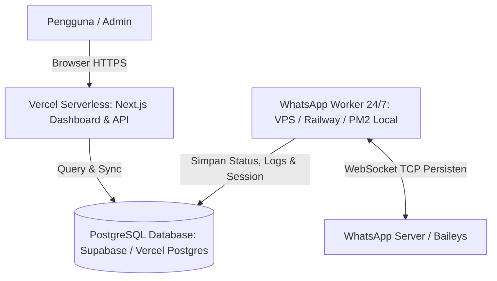

# 🚀 Panduan Lengkap Setup & Deploy ke Vercel & Database (Supabase / Vercel Postgres)

Panduan ini berisi instruksi lengkap langkah-demi-langkah untuk mendeploy project **VERAND.BOT (Next.js 16)** dan mengkonfigurasi Database ke **Vercel** dan **Supabase / Neon**.

---

## 🏗️ 1. Memahami Arsitektur Deployment

Project ini menggunakan arsitektur modern yang memisahkan antara **Web Dashboard** dan **WhatsApp Socket Worker**:



> [!IMPORTANT]
> **Mengapa Baileys Bot Perlu Worker 24/7?**
> Vercel Serverless Function memiliki batasan eksekusi otomatis mati (*freeze/timeout*) setelah 15 detik (Hobby) atau 60 detik (Pro). Socket WhatsApp (Baileys) membutuhkan koneksi WebSocket TCP yang terus hidup tanpa terputus (*persistent connection*).
> 
> **Solusi Standar:**
> 1. **Web Dashboard & REST API:** Di-host di **Vercel** (Cepat, gratis, SSL otomatis, CDN global).
> 2. **Database:** Di-host di **Supabase** atau **Vercel Postgres / Neon** (Free Tier PostgreSQL).
> 3. **Bot Worker (Baileys):** Dijalankan di **VPS / Railway / Fly.io / Komputer Lokal (PM2)** yang terhubung ke Database yang sama. Dashboard Vercel mengontrol dan memonitor bot secara real-time via Database.

---

## 🗄️ 2. Langkah 1: Setup Database PostgreSQL (Supabase / Vercel Postgres)

Pilih salah satu penyedia database berikut (Direkomendasikan: **Supabase** karena menyediakan GUI yang sangat ramah pengguna):

### Opsi A: Menggunakan Supabase (Sangat Direkomendasikan)
1. Kunjungi [supabase.com](https://supabase.com) lalu Login / Daftar akun (Gratis).
2. Klik **New Project**, beri nama (misalnya `botwa-db`), masukkan Database Password yang aman, lalu pilih region terdekat (misalnya `Singapore [ap-southeast-1]`).
3. Tunggu hingga database siap (±1-2 menit).
4. Masuk ke menu **SQL Editor** di panel sebelah kiri.
5. Klik **New query**, buka file [`schema.sql`](./schema.sql) yang ada di root project ini, salin seluruh kodenya, lalu tempelkan ke SQL Editor Supabase.
6. Klik tombol **Run** (Ctrl + Enter). Anda akan melihat notifikasi *Success. No rows returned*.
7. Ambil API Keys:
   - Masuk ke menu **Project Settings** (ikon gear di kiri bawah) -> **API**.
   - Salin **Project URL** (ini adalah `NEXT_PUBLIC_SUPABASE_URL`).
   - Salin **anon public key** (ini adalah `NEXT_PUBLIC_SUPABASE_ANON_KEY`).
   - Salin **service_role key** (ini adalah `SUPABASE_SERVICE_ROLE_KEY` - rahasiakan kunci ini).

### Opsi B: Menggunakan Vercel Postgres (Neon)
1. Buka dashboard project Anda di [vercel.com](https://vercel.com).
2. Masuk ke tab **Storage** -> klik **Create Database** -> pilih **Postgres (Powered by Neon)**.
3. Ikuti instruksi pembuatan database hingga selesai.
4. Masuk ke tab **Query**, lalu tempel dan jalankan isi file [`schema.sql`](./schema.sql).
5. Vercel secara otomatis akan menambahkan environment variable seperti `POSTGRES_URL`, `DATABASE_URL` ke project Anda.

---

## 🧪 3. Uji Koneksi Database Secara Lokal

Sebelum melakukan deploy ke Vercel, Anda dapat memverifikasi koneksi database di laptop/PC Anda:

1. Buat file `.env.local` di root project (salin dari [`.env.example`](./.env.example)):
   ```env
   NEXT_PUBLIC_SUPABASE_URL=https://xxxx.supabase.co
   NEXT_PUBLIC_SUPABASE_ANON_KEY=eyJhbGciOi...
   SUPABASE_SERVICE_ROLE_KEY=eyJhbGciOi...
   ```
2. Jalankan script penguji koneksi yang telah disediakan:
   ```bash
   node scripts/test-db-connection.js
   ```
3. Jika berhasil, Anda akan melihat output:
   ```text
   ✅ SUPABASE CONNECTION SUCCESSFUL!
   ✅ Table check: bot_instances: OK
   ✅ Table check: feature_configs: OK
   ✅ Table check: activity_logs: OK
   ✅ Table check: rate_limit_states: OK
   ```

---

## 🌐 4. Langkah 2: Deploy Dashboard ke Vercel

Ada 2 cara untuk mendeploy ke Vercel:

### Cara A: Melalui GitHub (Paling Mudah & Otomatis)
1. Push source code project Anda ke repositori GitHub:
   ```bash
   git add .
   git commit -m "feat: setup vercel deployment and supabase database integration"
   git push origin main
   ```
2. Buka dashboard [vercel.com](https://vercel.com) dan klik tombol **Add New...** -> **Project**.
3. Hubungkan akun GitHub Anda dan pilih repositori `botwav1`.
4. Vercel akan mendeteksi framework **Next.js** secara otomatis.
5. Jangan langsung klik Deploy! Buka accordion **Environment Variables** terlebih dahulu.
6. Masukkan variabel-variabel berikut (lihat [`.env.example`](./.env.example)):
   - `NEXT_PUBLIC_SUPABASE_URL`: URL project Supabase Anda.
   - `NEXT_PUBLIC_SUPABASE_ANON_KEY`: Kunci anonim Supabase Anda.
   - `SUPABASE_SERVICE_ROLE_KEY`: Kunci service role Supabase Anda.
   - `NEXT_PUBLIC_APP_URL`: Kosongkan dulu atau isi domain sementara Vercel (misal `https://botwav1.vercel.app`).
   - `BOT_OWNER_NUMBER`: Nomor WhatsApp Anda dengan format internasional tanpa tanda `+` (contoh: `6281234567890`).
   - `GEMINI_API_KEY`: API Key Google Gemini (opsional jika fitur AI diaktifkan).
7. Klik tombol **Deploy**.
8. Vercel akan menjalankan build (`npm run build`). Tunggu sekitar 1 menit hingga statusnya menjadi **Ready** 🎉.

### Cara B: Melalui Vercel CLI (Command Line)
Jika Anda lebih suka menggunakan terminal langsung:
1. Jalankan perintah login:
   ```bash
   npx vercel login
   ```
   Pilih metode login yang sesuai (GitHub / Email).
2. Lakukan inisialisasi dan deploy:
   ```bash
   npx vercel
   ```
   - Set up and deploy? **Y**
   - Which scope? Pilih akun Anda
   - Link to existing project? **N** (atau Y jika sudah ada)
   - Project name? Tekan Enter untuk default
   - In which directory? Tekan Enter (`./`)
   - Want to modify settings? **N**
3. Tambahkan environment variables melalui CLI:
   ```bash
   npx vercel env add NEXT_PUBLIC_SUPABASE_URL
   npx vercel env add NEXT_PUBLIC_SUPABASE_ANON_KEY
   npx vercel env add SUPABASE_SERVICE_ROLE_KEY
   ```
4. Deploy ke tahap produksi (Production):
   ```bash
   npx vercel --prod
   ```

---

## ⚙️ 5. File Konfigurasi yang Telah Disiapkan

Project ini sudah dilengkapi dengan file-file pendukung deployment:

1. **[`vercel.json`](./vercel.json)**:
   - Mengatur Next.js framework build preset.
   - Menambahkan header keamanan (`X-Content-Type-Options: nosniff`, `X-Frame-Options: DENY`, `X-XSS-Protection`).
   - Mengatur caching untuk aset statis (`/_next/static/`).
2. **[`schema.sql`](./schema.sql)**:
   - Tabel `bot_instances`: Menyimpan status online/offline, nomor bot, dan nama sesi.
   - Tabel `feature_configs`: Menyimpan saklar toggle on/off tiap fitur (Downloader, AI, Stiker, Game, dll.).
   - Tabel `activity_logs`: Menyimpan riwayat perintah yang dijalankan pengguna WhatsApp.
   - Tabel `rate_limit_states`: Menyimpan limit penggunaan kuota per nomor pengguna.
3. **[`lib/supabase/client.ts`](./lib/supabase/client.ts)**:
   - Client Supabase siap pakai dengan fungsi helper: `dbSaveBotInstance`, `dbSaveFeatureConfigs`, `dbLoadFeatureConfigs`, `dbInsertActivityLog`, dan `dbGetActivityLogs`.
4. **[`scripts/test-db-connection.js`](./scripts/test-db-connection.js)**:
   - Script mandiri untuk menguji koneksi database kapan pun Anda ingin mengeceknya.

---

## 🤖 6. Menjalankan Bot Worker 24/7 (Koneksi ke Baileys)

Setelah Dashboard Next.js Anda aktif di Vercel dan database Supabase aktif, Anda dapat menjalankan Bot Worker 24/7:

### Opsi 1: Di VPS / Server Linux (Menggunakan PM2)
1. Clone repositori ke server Anda:
   ```bash
   git clone <repo-anda>
   cd botwav1
   npm install
   ```
2. Buat file `.env.local` dengan kredensial Supabase yang sama seperti di Vercel.
3. Jalankan bot dengan process manager PM2:
   ```bash
   npm install -g pm2
   pm2 start npm --name "wa-bot-worker" -- run dev
   pm2 save
   pm2 startup
   ```

### Opsi 2: Di Railway / Fly.io / Render (Cloud Container Gratis/Murah)
1. Hubungkan repo ke Railway atau Render.
2. Tambahkan Environment Variable database.
3. Start command: `npm run dev` atau build & run.
4. Worker akan tetap hidup 24/7 dan socket Baileys tidak akan terputus.

---

## 🔍 7. Checklist Akhir Verifikasi

- [x] Next.js Build Berhasil tanpa error (`npm run build` sukses 100%).
- [x] File `vercel.json` dan `.env.example` sudah siap.
- [x] Tabel database didefinisikan secara universal di `schema.sql`.
- [x] Dashboard API otomatis tersinkronisasi dengan Database Supabase.
- [x] Script pengujian `node scripts/test-db-connection.js` siap dijalankan.
